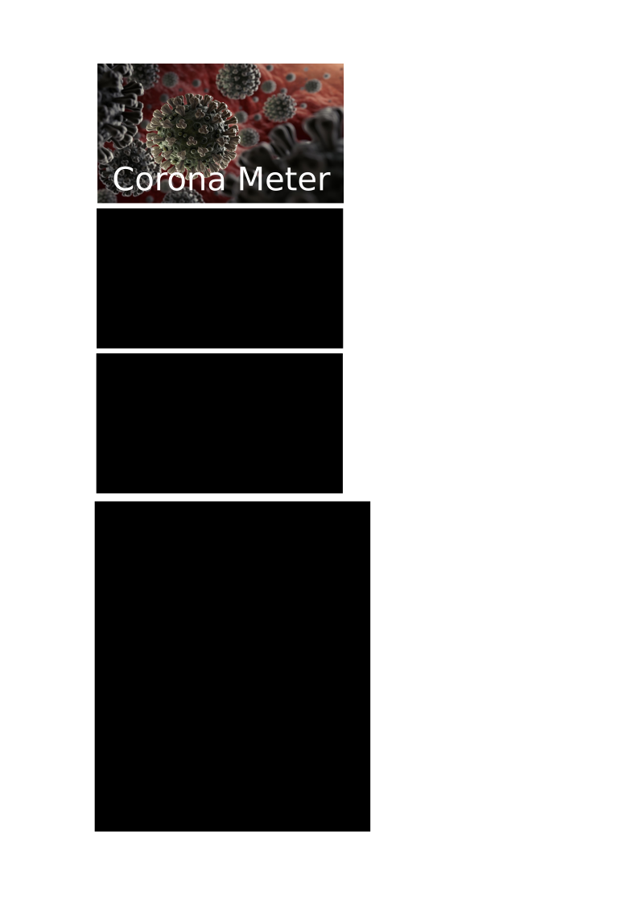

# corona-meter

Corona Meter is a DIY Project which uses an ESP 32 Dev Board and 0.96 inch OLED Module to Update Corona Virus Stats.

## Hardware Used

* [ESP 32 Dev Board](https://www.banggood.com/ESP32-Development-Board-WiFibluetooth-Ultra-Low-Power-Consumption-Dual-Cores-ESP-32-ESP-32S-Board-p-1109512.html)
* [0.96 inch OLED](https://www.amazon.com/gp/product/B00O2LKEW2/ref=as_li_tl?ie=UTF8&camp=1789&creative=9325&creativeASIN=B00O2LKEW2&linkCode=as2&tag=interlk-20&linkId=7d384e77663fba7c738ee24967c28c03)

## Enclosure

A prism like enclosure made out of 3 faces which are 8 cm long and 4.5 cm wide. One faces has a rectangular cut for the OLED Module. 

## References

* [ESP 32 + OLED Connectivity](http://arduino-er.blogspot.com/2017/04/connect-i2c-128x64-oled-ssd1306-to.html)
* [ESP 32 Programming in Arduino IDE](https://github.com/espressif/arduino-esp32)
* [Arduino WiFi Library - Client](https://www.arduino.cc/en/Tutorial/WiFiWebClient)
* [Sri Lankan Health Promotion Bureau Corona Statistics API](https://healthpromo.gov.lk/en/api-documentation)
* [ArduinoJson Library](https://randomnerdtutorials.com/decoding-and-encoding-json-with-arduino-or-esp8266/)

